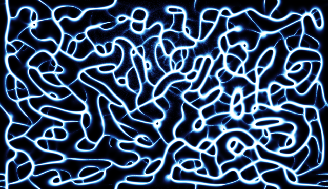

# 08 — Physarum on the GPU

The slime-mold instrument's engine (`dtouch/physarum.py`, numpy) moved to the GPU as
`dtouch/physarum_gl.py` — the TouchDesigner target is the classic **GLSL feedback-loop
physarum**: agents in a float texture, ping-pong update, additive point deposit, blur+decay
on the trail. This experiment is the benchmark that justified it, kept so the numbers can be
re-taken on another machine with the same method.

## How it works

No compute shaders (macOS stops at GL 4.1); everything is GL 3.3 core:

- **agents** — one texel per agent in an RGBA32F texture `(x, y, heading, spare)`; the
  update pass is a full-screen triangle whose fragment shader does one Jones step per texel
  (sense three points of trail+food, turn, move, wrap, occasionally respawn onto matte*luma)
  and writes the next agent texture. Two agent textures ping-pong.
- **deposit** — an attribute-less `GL_POINTS` draw of N vertices; the vertex shader
  `texelFetch`es its own agent by `gl_VertexID` and lands a 1 px point on the agent's cell,
  blended `ONE, ONE` into a float "laid" texture. `np.bincount`, on the GPU.
- **diffuse + decay** — a separable box blur (H adds the deposits in, V multiplies by decay),
  ping-ponging the trail.
- **picture** — the tonemap runs on the GPU and is read back as uint8 (the mode quantizes to a
  256-entry palette LUT anyway); its two statistics (trail p95, deposit mean) come from a
  1/4-res subsample pass read back as floats.

Same contract as the CPU field (`update(matte, gray)`, `luminance()`, `spawn_burst`, `wave`,
matte-blended behavior points), so `PhysarumMode` picks whichever boots and falls back to
numpy with an amber toast when no GL context can be had.

## Run

```bash
pip install -e ../..
python bench.py                 # CPU 400k @ 576x324 vs GPU at four sizes, + raw readback costs
python bench.py --frames 120
```

Headless: standalone context only, no window, no camera. Writes `out/physarum_gl.png`.

## Measured (Apple M4 Max, macOS, GL 4.1 Metal; best / median of 60 frames)

| engine | agents    | grid     | sim ms        | picture ms  | frame ms      | fps (med) |
|--------|-----------|----------|---------------|-------------|---------------|-----------|
| CPU    | 400,000   | 576x324  | 20.22 / 20.89 | 0.75 / 1.00 | 20.42 / 21.69 | 46        |
| GPU    | 400,000   | 576x324  |  0.85 /  0.93 | 0.50 / 0.56 |  1.23 /  1.32 | 755       |
| GPU    | 1,000,000 | 1280x736 |  2.92 /  3.38 | 1.22 / 1.39 |  4.10 /  4.78 | 209       |
| GPU    | 2,000,000 | 1280x736 |  4.83 /  5.60 | 1.22 / 1.45 |  6.32 /  7.64 | 131       |
| GPU    | 4,000,000 | 1280x736 |  8.55 / 10.77 | 1.28 / 1.45 | 11.08 / 13.30 | 75        |

*sim* = `update()` (+ `ctx.finish()` on the GPU, so it is the GPU's cost, not the enqueue);
*picture* = `luminance()` including the readback; *frame* = the two back to back with no
extra sync — what the mode pays per step before colorize/upscale.

Raw `glReadPixels` at 1280x736, best of 30: R32F 3.77 MB **0.32 ms** · R8 0.94 MB
**0.36 ms** · RGB8 2.83 MB **0.50 ms**. Readback is not the bottleneck on this machine — the
uint8 path is kept because it is free and the picture is 8-bit anyway.

Full `PhysarumMode.step()` (matte + resizes + sim + picture + palette + upscale to 1080p),
median: CPU engine 24.7 ms at 400k/576x324; GPU engine **9.3 ms at 2M/1280x736** — after
swapping the palette's numpy fancy index (4.4 ms at that grid) for `cv2.applyColorMap`
(0.09 ms, pixel-identical).

## Sample output

4M agents on 1280x736, arctic palette, after 70 frames of a drifting synthetic subject:



## Notes

- Clean-room: Jeff Jones's model plus this repo's `physarum.py` semantics. No code or
  parameter tables from CC BY-NC-SA physarum projects.
- Known differences from the CPU field, none visible on the instrument: the blur wraps
  (cv2 reflects), deposit weight is read at the post-move cell, p95 is estimated on a
  stride-4 subsample, reseeding is per-agent Bernoulli with rejection sampling.
- Only measured on macOS/Apple silicon. Linux Mesa should run the same GL 3.3 path; not
  verified here.
